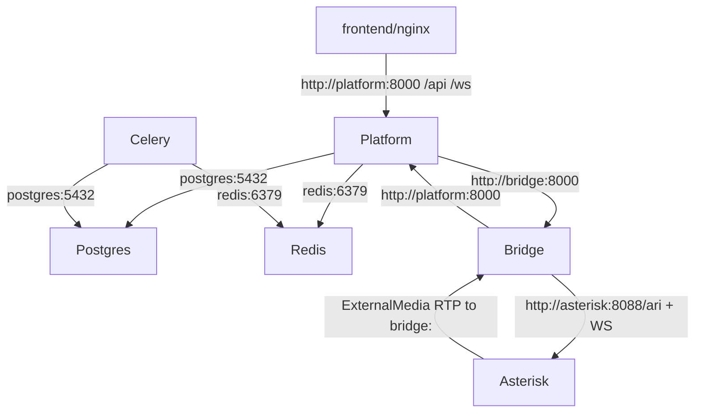

Generated From: Current Repository State
Last Reviewed: 2026-07-01
Source of Truth: Code
Intended Audience: AI Coding Assistants & Developers
Estimated Reading Time: 10-15 minutes

# Overview

Deployment is Docker Compose based. The root `docker-compose.yml` defines the service graph; `docker-compose.local.yml`, `docker-compose.staging.yml`, and `docker-compose.prod.yml` overlay container names and host port mappings. `start.sh` is the intended entrypoint because it selects the environment, generates host/NAT env, creates generated Asterisk directories, loads env files, and then invokes Compose.

There is no CI/CD pipeline visible in the repository. Deployment workflow is script-driven Compose.

# Responsibilities

Deployment layer owns:

- Service composition.
- Environment selection.
- Port mapping.
- Container naming.
- Shared volumes.
- Docker networks.
- Generated host env for SIP/NAT.
- Asterisk template rendering.
- Health checks.
- Bootstrap container execution.

Deployment layer does not own:

- Business migrations beyond invoking backend startup/bootstrap.
- Runtime telephony call logic.
- Frontend app logic.
- External provider provisioning (DIDWW/Pinecone/Google keys must be supplied).

# Important Files

- `docker-compose.yml`: base stack: postgres, redis, platform, platform_init, celery_worker, frontend, asterisk, bridge.
- `docker-compose.local.yml`: local project name/container names and ports: platform 8000, frontend 8080, ARI 8088, SIP 5060, RTP 10000-10050.
- `docker-compose.staging.yml`: staging names and shifted ports: platform 8001, frontend 8081, ARI 8089, SIP 5061, RTP 10060-10110.
- `docker-compose.prod.yml`: prod names and standard ports similar to local, with prod container names.
- `start.sh`: canonical Compose wrapper.
- `Makefile`: convenience targets using `start.sh`.
- `scripts/ensure-host-env.sh`: generates `.host.<env>.env`.
- `scripts/refresh-ip.sh`: regenerates host env and recreates Asterisk.
- `scripts/check.sh`: stack verification.
- `bridge/Dockerfile`: Python bridge image with libsamplerate runtime.
- `eplanet-calling-agent/gemini-sales-agent/backend/Dockerfile`: Python platform/Celery/bootstrap image with Docker CLI.
- `eplanet-calling-agent/gemini-sales-agent/frontend/Dockerfile`: frontend build/runtime image.
- `frontend/nginx.conf`: serves SPA and proxies API/WebSocket.
- `asterisk/entrypoint-wrap.sh`: renders Asterisk runtime config.

# Runtime Flow

## Environment Selection

`start.sh` accepts `local`, `staging`, `prod`, or uses `DEPLOY_ENV`/`APP_ENV`, defaulting to local.

Environment selection controls:

- Compose overlay file.
- Compose project name `aura_<env>`.
- Default app env file (`.env`, `.env.staging`, `.env.prod`).
- Generated host env file `.host.<env>.env`.
- Default SIP port.
- Generated Asterisk directory `asterisk/generated_<env>`.

## Startup

```
./start.sh <env> up -d --build
-> validate app env file exists
-> mkdir asterisk/generated_<env>
-> scripts/ensure-host-env.sh
-> export variables from app env + host env
-> docker info preflight
-> docker compose -f docker-compose.yml -f docker-compose.<env>.yml -p aura_<env> ...
```

Compose startup order:

1. PostgreSQL and Redis start with health checks.
2. Platform starts after DB/Redis healthy and runs FastAPI startup DB init.
3. Asterisk starts and renders templates through `entrypoint-wrap.sh`.
4. Frontend starts after platform healthy.
5. Bridge starts after Asterisk and platform healthy.
6. `platform_init` runs bootstrap after platform healthy.
7. Celery worker starts after DB/Redis healthy.

## Shutdown

`./start.sh <env> down` invokes Compose down. Persistent data remains in named volumes unless removed explicitly outside the documented scripts.

# Data Flow

Container communication:



External traffic:

```
Browser -> host frontend port -> frontend nginx -> platform
Browser/dev tools -> host platform port when exposed
Phone/PSTN -> host SIP UDP port -> Asterisk
Phone media -> host Asterisk RTP range -> Asterisk
Diagnostics -> host ARI port -> Asterisk ARI
```

# Dependencies

Services:

- `postgres`: `postgres:16-alpine`, named volume `postgres_data`.
- `redis`: `redis:7-alpine`.
- `platform`: backend Dockerfile, volumes `uploads_data`, generated Asterisk dir, Docker socket.
- `platform_init`: same image as platform, command `python -m backend.scripts.bootstrap`.
- `celery_worker`: same backend image, command `celery -A backend.celery_app worker --loglevel=info`.
- `frontend`: frontend image serving nginx.
- `asterisk`: `andrius/asterisk:22`, config templates and generated dialplan mounts.
- `bridge`: bridge image.

Networks:

- `default`: app/data network.
- `voip`: Asterisk, bridge, and platform for telephony/internal control.

Volumes:

- `postgres_data`: database.
- `uploads_data`: uploaded documents.
- `./asterisk/generated_<env>`: generated DID dialplan shared between backend/init/Celery and Asterisk.

External APIs:

- Google Gemini API.
- Pinecone.
- Google OAuth/Calendar.
- DIDWW SIP infrastructure if trunk/DID is used.

# Configuration

App env files:

- Local: `.env`
- Staging: `.env.staging`
- Production: `.env.prod`

Generated host env files:

- Local: `.host.local.env`
- Staging: `.host.staging.env`
- Production: `.host.prod.env`

Note: root listing also includes `.host.env`, but `start.sh` uses `.host.<env>.env`. Compose defaults mention `.host.env`, but `start.sh` exports `HOST_ENV_FILE` to the environment-specific file.

Ports by overlay:

| Environment | Frontend | Platform | ARI | SIP UDP | Asterisk RTP |
| --- | ---: | ---: | ---: | ---: | --- |
| local | 8080 | 8000 | 8088 | 5060 | 10000-10050/udp |
| staging | 8081 | 8001 | 8089 | 5061 | 10060-10110/udp |
| prod | 8080 | 8000 | 8088 | 5060 | 10000-10050/udp |

Important env variables:

- `APP_ENV_FILE`: override selected `.env*`.
- `HOST_ENV_FILE`: selected/generated host env.
- `DEPLOY_ENV`: local/staging/prod.
- `EXTERNAL_IP`: auto/windows/fixed LAN/public IP for SIP/RTP NAT.
- `GEMINI_API_KEY`, `PINECONE_API_KEY`, `BRIDGE_INTERNAL_TOKEN`, `JWT_SECRET_KEY`.
- `DATABASE_URL`, `REDIS_URL`: injected by Compose for platform/Celery.
- `BRIDGE_URL`: `http://bridge:8000` for platform.
- `PLATFORM_URL`: `http://platform:8000` for bridge.

# Design Decisions

- Environment overlays keep one base service graph while allowing local/staging/prod to coexist with different names/ports.
- `start.sh` is required because Docker Compose alone does not generate the host LAN/IP env that Asterisk needs for physical phones.
- SIP port uses `mode: host` publishing to preserve the phone source IP in registration.
- Asterisk config is rendered at container start because NAT values and passwords depend on runtime env.
- The backend image includes Docker CLI and mounts Docker socket so it can reload Asterisk dialplan after generated DID config changes.
- `platform_init` is a one-shot bootstrap container instead of embedding seed behavior into every platform startup.
- The platform is on both networks because it must talk to app/data services and bridge/Asterisk-side services.

# Critical Files

- `start.sh`: changing it affects every environment startup.
- `docker-compose.yml`: service contracts, dependencies, volumes, and networks.
- `docker-compose.*.yml`: host port and container-name isolation.
- `scripts/ensure-host-env.sh`: SIP NAT correctness.
- `scripts/check.sh`: codified health/diagnostic assumptions.
- `asterisk/entrypoint-wrap.sh`: runtime config generation.
- Backend and bridge Dockerfiles: dependency availability, especially Docker CLI and libsamplerate.
- `frontend/nginx.conf`: API/websocket proxy contract.

Generated files:

- `.host.<env>.env`
- `asterisk/generated_<env>/org-dids.conf`
- Container runtime `/etc/asterisk/pjsip.conf`
- Container runtime `/etc/asterisk/rtp.conf`

# Common Debugging

- Compose env file missing: `start.sh` will fail before Compose. Create `.env`, `.env.staging`, or `.env.prod`, or set `APP_ENV_FILE`.
- Docker permission issue: `start.sh` checks `docker info` and prints group/daemon guidance.
- Wrong IP after DHCP change: run `./scripts/refresh-ip.sh <env>` and update phone SIP server.
- Phone registers to wrong host: inspect `.host.<env>.env` and check script output.
- Staging conflicts with local/prod: verify shifted ports 5061/8081/8001/8089/10060-10110.
- Frontend reachable but API fails: check frontend nginx proxy and platform health.
- Bridge unhealthy: check Asterisk/platform health and ARI credentials.
- Asterisk NAT missing: `scripts/check.sh` verifies `external_media_address` in runtime `pjsip.conf`.
- DID changes not active: check platform Docker socket mount, generated config file, and Asterisk dialplan reload.
- Celery indexing stuck: inspect `aura_*_celery` logs, Redis, uploads volume, Pinecone/Gemini keys.

# AI Guidance

Deployment invariants:

- Use `./start.sh <env> ...`, not bare `docker compose`, for normal stack operations.
- Keep base Compose service names stable because other services use DNS names such as `platform`, `bridge`, `asterisk`, `postgres`, and `redis`.
- Keep platform connected to both `default` and `voip` networks.
- Keep bridge and Asterisk on `voip`.
- Keep generated Asterisk directory mounted into platform/init/Celery and Asterisk.
- Keep `BRIDGE_INTERNAL_TOKEN` identical between platform and bridge.
- Do not remove Asterisk host env generation unless replacing NAT handling completely.

Where to change:

- New service: add to base `docker-compose.yml` and environment overlays only if host ports/names differ.
- New environment: add `.env.<env>`, `.host.<env>.env` handling in scripts, a Compose overlay, Makefile/check support if needed.
- New exposed port: update relevant overlay and `scripts/check.sh`.
- New generated telephony config: mount it like existing generated DID config and document reload behavior.
- New frontend proxy path: update `frontend/nginx.conf`.

Avoid:

- Hard-coding host IPs in Compose or Asterisk templates.
- Editing `.host.<env>.env` by hand as durable config.
- Assuming local and prod can run simultaneously without port changes.
- Removing Docker socket mount without replacing dialplan reload behavior.
- Depending on README port 80 if current overlay maps frontend to 8080/8081.
