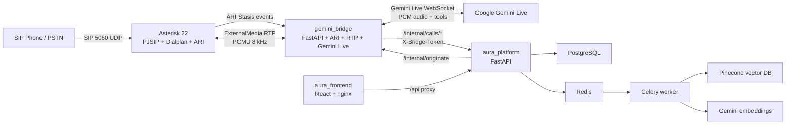
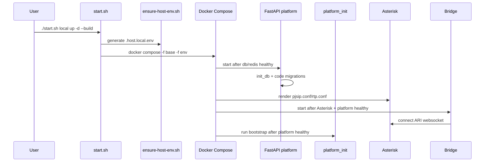
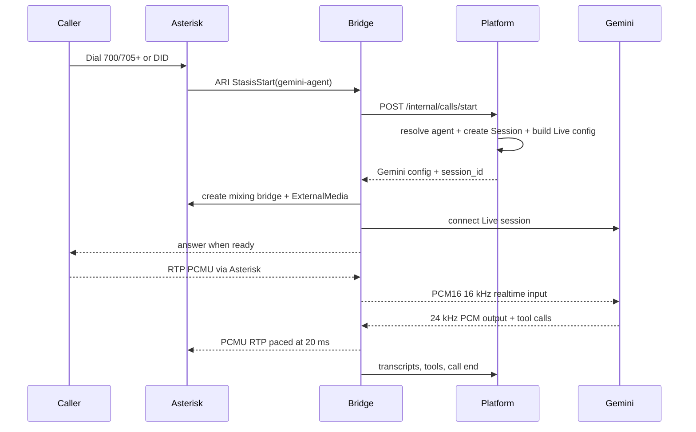
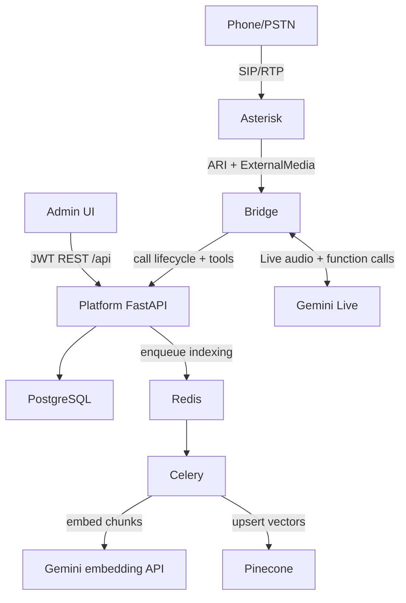

Generated From: Current Repository State
Last Reviewed: 2026-07-01
Source of Truth: Code
Intended Audience: AI Coding Assistants & Developers
Estimated Reading Time: 10-15 minutes

# Overview

This repository is a Docker Compose based AI voice sales platform. It combines:

- A React/Vite admin frontend.
- A FastAPI platform backend.
- PostgreSQL persistence.
- Redis/Celery background indexing.
- Asterisk 22 for SIP, dialplan, ARI, and RTP.
- A Python FastAPI bridge that owns ARI events, per-call RTP, and Gemini Live sessions.
- Google Gemini, Pinecone, and Google OAuth/Calendar integrations.

The platform is organized around phone-call sessions. The backend stores agents, organizations, users, sessions, transcripts, leads, contacts, notes, campaign state, documents, tool calls, and generated outputs. Asterisk handles SIP registration and call routing into ARI Stasis. The bridge listens to ARI, creates a per-call ExternalMedia RTP leg, streams phone audio to Gemini Live, streams Gemini audio back to Asterisk, and posts session lifecycle events back to the platform.

The most important boundary: **platform owns business data and API behavior; bridge owns live telephony/media; Asterisk owns SIP/dialplan; frontend owns admin workflows.** The platform does not subscribe to ARI or process RTP.

# Responsibilities

The root repository owns composition, runtime environment selection, telephony configuration, bridge service, and the nested sales-agent application.

The backend owns:

- Authentication and authorization checks.
- Multi-tenant organization, DID, agent, and user data.
- CRM entities: leads, contacts, notes, sessions, campaigns, outputs.
- RAG document ingestion orchestration and Pinecone namespace decisions.
- Gemini Live configuration generation for the bridge.
- Internal bridge APIs for call start, transcript, tools, dial status, and call end.

The bridge owns:

- ARI websocket connection.
- Stasis event lifecycle.
- ARI originate for outbound calls.
- ARI bridge and ExternalMedia creation.
- Per-call RTP sockets and media conversion.
- Gemini Live session lifecycle.
- Realtime tool-call forwarding to the platform.

Asterisk owns:

- SIP registration for lab endpoints 1000-1010.
- DIDWW inbound/outbound PJSIP endpoint definitions.
- Dialplan routing into `Stasis(gemini-agent)`.
- RTP range and NAT-sensitive Contact/media address configuration.

The frontend owns:

- Admin SPA routing and role-aware navigation.
- JWT token storage and API calls.
- Pages for agents, organizations, sessions, outbound, campaigns, CRM, documents, settings, access requests, and docs.

The repository does not show a CI/CD pipeline. Deployment automation is local shell scripts plus Docker Compose environment overlays.

# Important Files

- `docker-compose.yml`: base service graph for PostgreSQL, Redis, platform, one-shot platform bootstrap, Celery, frontend, Asterisk, and bridge.
- `docker-compose.local.yml`, `docker-compose.staging.yml`, `docker-compose.prod.yml`: environment-specific container names and host port mappings.
- `start.sh`: canonical entrypoint for Compose. It selects environment, generates host NAT env, creates generated Asterisk directories, exports env files, performs Docker preflight, and invokes Compose.
- `scripts/ensure-host-env.sh`: generates `.host.<env>.env` with LAN `EXTERNAL_IP`, SIP port, lab extension credentials, and NAT values.
- `scripts/check.sh`: stack verification script for container health, platform/frontend HTTP, ARI registration, bridge connection, Asterisk NAT, RTP range, and SIP endpoints.
- `asterisk/extensions.conf`: static dialplan. Lab extensions 700-704 route to fleet callback behavior; 705-799 route by agent extension; 600 is echo; `[from-trunk]` routes DIDs to Stasis.
- `asterisk/pjsip.conf.template`: SIP endpoints, NAT behavior, lab users, DIDWW inbound identification, and DIDWW outbound trunk.
- `asterisk/entrypoint-wrap.sh`: renders Asterisk runtime `pjsip.conf` and `rtp.conf` from templates and host env.
- `bridge/app/main.py`: live telephony core. ARI, RTP, Gemini Live, platform callbacks, outbound originate, call cleanup.
- `bridge/app/call_session.py`: per-call state container used for concurrent calls.
- `eplanet-calling-agent/gemini-sales-agent/backend/main.py`: FastAPI app entrypoint and router registration.
- `eplanet-calling-agent/gemini-sales-agent/backend/db/models.py`: canonical data model.
- `eplanet-calling-agent/gemini-sales-agent/backend/routers/internal_bridge.py`: internal bridge-to-platform call lifecycle API.
- `eplanet-calling-agent/gemini-sales-agent/backend/services/live_config.py`: transforms DB agents, context, KB preload, and tools into Gemini Live config.
- `eplanet-calling-agent/gemini-sales-agent/frontend/src/App.tsx`: SPA route graph.
- `eplanet-calling-agent/gemini-sales-agent/frontend/src/lib/api.ts`: browser API abstraction and same-origin API base.

# Runtime Flow

## Startup

The platform starts by creating tables and applying migrations in code. `platform_init` then runs bootstrap scripts: migrations, admin creation, default organization, seed agents, optional Pinecone index creation, and optional RAG seed documents.

## Authentication

Local login:

Frontend login page -> `POST /api/auth/login` -> backend verifies password -> returns access and refresh JWT -> frontend stores access token and user in `localStorage` -> protected routes include bearer token.

Google login:

Frontend redirects to `/api/auth/google` -> backend redirects to Google -> callback exchanges code -> user is linked or created -> frontend callback receives JWTs in query params. New Google users are unapproved until access-request flow completes.

Calendar OAuth is separate from login OAuth. `/api/calendar/auth` requests Calendar scope and stores encrypted per-user tokens in `google_calendar_tokens`.

## Inbound Call

Inbound routing is callback-aware. Fleet extensions 700-704 are treated as sales fleet entrypoints. If the caller previously received an outbound call, backend callback routing can return the same agent when available and DID matches. Dedicated lab extensions 705-799 route by `Agent.inbound_extension`.

## Outbound Call

Admin UI -> `POST /api/outbound/dial` or campaign flow -> backend validates agent, DNC/call-window policy, endpoint/caller ID, and bridge capacity -> backend calls bridge `/internal/originate` -> bridge uses ARI originate -> resulting Asterisk channel enters Stasis -> normal per-call bridge/Gemini flow begins.

Outbound can use lab endpoints such as `PJSIP/1001` or trunk-style endpoints, depending on resolver/settings and Asterisk trunk configuration.

## RAG Ingestion

Frontend document upload -> `POST /api/documents` -> backend writes file under `uploads` volume and creates `Document` row -> Celery task extracts text, chunks, embeds with Gemini embedding model, and upserts to Pinecone -> document status becomes `indexed` or `failed`.

During call start and tool use, backend queries Pinecone using strict organization/agent namespaces. For organization-scoped agents, it avoids global fallback to prevent cross-tenant leakage.

# Data Flow

High-level data flow:

Important persisted data:

- `organizations`: tenant boundary and DID source of truth.
- `agents`: prompts, model, voice, enabled tools, organization/DID, inbound extension.
- `sessions`: call/web sessions, status, metadata, summary, token/RAG metrics.
- `messages`: transcript turns from bridge/browser.
- `tool_calls`: tool invocation audit trail.
- `leads`, `contacts`, `notes`: CRM entities.
- `documents`: uploaded files and indexing state.
- `campaigns`, `campaign_leads`: outbound campaign state.
- `google_calendar_tokens`: encrypted per-user calendar OAuth tokens.

# Dependencies

Internal services:

- `frontend` depends on `platform`.
- `platform` depends on PostgreSQL and Redis.
- `platform_init` depends on platform health.
- `celery_worker` depends on PostgreSQL and Redis.
- `asterisk` depends on generated host env and templates.
- `bridge` depends on Asterisk and platform health.

External systems:

- Google Gemini Live for realtime voice sessions.
- Google Gemini embeddings for document vectors.
- Google text model for summaries/outputs, where used by backend services.
- Pinecone for vector search.
- Google OAuth and Calendar APIs.
- DIDWW SIP trunk endpoints are configured in Asterisk templates, but actual use depends on credentials/IP whitelist and provider setup.

Shared resources:

- `postgres_data` volume stores platform database.
- `uploads_data` volume stores uploaded documents.
- `./asterisk/generated_<env>` is mounted into platform/Celery/init and Asterisk for generated DID dialplan.
- Docker socket is mounted into platform so backend can best-effort reload Asterisk dialplan after organization DID changes.

# Configuration

Meaningful root env files:

- `.env`: local/default app env.
- `.env.staging`: staging app env.
- `.env.prod`: production app env.
- `.host.<env>.env`: generated host/LAN/SIP env; do not edit manually.

Key variables:

- `GEMINI_API_KEY`: required by bridge and backend Gemini clients.
- `GEMINI_TEXT_MODEL`, `GEMINI_MODEL`: backend text model and bridge fallback live model.
- `PINECONE_API_KEY`, `PINECONE_INDEX_NAME`, `PINECONE_ENVIRONMENT`: RAG.
- `BRIDGE_INTERNAL_TOKEN`: shared secret for platform <-> bridge internal APIs.
- `BRIDGE_URL`: platform-to-bridge URL, normally `http://bridge:8000`.
- `PLATFORM_URL`: bridge-to-platform URL, normally `http://platform:8000`.
- `ARI_USER`, `ARI_PASS`, `ARI_APP`: must match Asterisk ARI config and bridge env.
- `EXTERNAL_IP`: `auto`, `windows`, or fixed LAN IP for Asterisk SIP/RTP NAT.
- `SIP_PORT`: local/prod 5060, staging 5061 by overlay.
- `ASTERISK_RTP_START`, `ASTERISK_RTP_END`: Asterisk media range.
- `RTP_PORT_BASE`, `RTP_PORT_COUNT`: bridge ExternalMedia receive ports.
- `OUTBOUND_MODE`, `OUTBOUND_TRUNK_NAME`, `OUTBOUND_TRUNK_CALLER_ID`: outbound endpoint/caller behavior.
- `GOOGLE_CLIENT_ID`, `GOOGLE_CLIENT_SECRET`, `GOOGLE_REDIRECT_URI`, `CALENDAR_REDIRECT_URI`, `CALENDAR_ENCRYPTION_KEY`: OAuth and Calendar.

# Design Decisions

- ARI/media live outside the platform backend. This keeps API/database behavior separate from timing-sensitive RTP and Gemini websocket behavior.
- Asterisk uses `Stasis(gemini-agent)` rather than answering directly in dialplan. The bridge can ring until Gemini is ready, then answer.
- Asterisk ExternalMedia is used to move RTP to the bridge. The bridge converts PCMU 8 kHz telephony audio to Gemini-compatible PCM and back.
- Each call has isolated state, RTP port, queues, Gemini Live session, and optional APM state. This prevents cross-call audio/tool/session leakage.
- Organization DID is the tenant boundary for inbound routing and outbound caller ID. Agents copy org DID, and organization changes sync generated Asterisk DID dialplan.
- RAG namespaces are tenant-aware: organization and agent namespaces are queried, without global fallback for org agents.
- Bootstrap is idempotent and runs as a one-shot container so initial state can be recreated without manual DB setup.

# Critical Files

Modify carefully:

- `bridge/app/main.py`: timing-sensitive RTP, ARI, Gemini Live, cleanup, and call state. Small mistakes can break all calls.
- `asterisk/pjsip.conf.template`: NAT/contact behavior is fragile. Broad `local_net` changes can cause 30-second call drops.
- `asterisk/extensions.conf`: controls which calls enter ARI; wrong contexts can bypass the bridge.
- `asterisk/entrypoint-wrap.sh`: renders runtime Asterisk config. Template token changes must stay aligned.
- `backend/routers/internal_bridge.py`: internal contract between bridge and platform.
- `backend/services/live_config.py`: prompt/tool/context assembly and tenant-safe KB preload.
- `backend/services/rag_service.py`: namespace isolation and Pinecone index behavior.
- `backend/db/models.py`: schema source for table creation and migrations.
- `start.sh` and `scripts/ensure-host-env.sh`: deployment and NAT preflight behavior.

Generated files:

- `.host.<env>.env`: generated by scripts.
- `asterisk/generated_<env>/org-dids.conf`: generated by backend organization sync/bootstrap.
- Asterisk runtime `/etc/asterisk/pjsip.conf` and `/etc/asterisk/rtp.conf`: rendered inside container.

# Common Debugging

- Startup fails: run `./start.sh <env> ps`, inspect platform/bridge/Asterisk logs, and verify `.env*` exists for the selected environment.
- Platform unhealthy: check PostgreSQL health, `DATABASE_URL`, import errors in backend, and migrations in `backend/db/migrate.py`.
- Frontend cannot reach API: nginx proxies `/api` and `/ws` to `platform:8000`; local direct API is on overlay host port.
- Auth fails: check JWT secret consistency, `/api/auth/me`, localStorage token, Google OAuth redirect URIs.
- Google Calendar fails: check Calendar redirect URI, client secret, and `CALENDAR_ENCRYPTION_KEY`.
- RAG fails: check `PINECONE_API_KEY`, Celery logs, document status, and Pinecone index readiness.
- Telephony registration fails: check generated `.host.<env>.env`, `EXTERNAL_IP`, SIP port mapping, phone on same network, and `pjsip show endpoints`.
- No audio/call drops: check Asterisk `external_media_address`, RTP range, phone codec PCMU, and avoid using Docker-internal IP as SIP server.
- Bridge not active: check ARI credentials/app name, bridge `/health`, ARI `/applications`, and Asterisk health.
- Outbound stuck: check bridge `/internal/status`, backend `/api/outbound/status`, endpoint format, active-call capacity, DNC/call-window policy, and SIP registration for lab endpoints.

# AI Guidance

Read in this order for most changes:

1. `context/PROJECT_CONTEXT.md`
2. Relevant specialized context file.
3. Entry file for the service you are changing.
4. Service modules around the specific flow.

Architectural invariants:

- Do not move ARI or RTP processing into the platform backend.
- Do not let frontend call bridge internal APIs directly.
- Keep bridge/platform internal APIs protected by `X-Bridge-Token`.
- Do not bypass organization/DID scoping for agents, documents, or RAG.
- Do not edit generated Asterisk DID files as source of truth.
- Do not hard-code local LAN IPs in source files; use env and generated host env.
- Keep outbound dialing through backend policy and bridge originate, not direct frontend-to-bridge calls.
- Keep tool declarations in one place (`tool_executor.py`) and filter them by agent enabled tools.

Where features belong:

- New admin screen: frontend `src/pages/admin`, route in `src/App.tsx`, nav in `AdminLayout.tsx`, API calls through `src/lib/api.ts`.
- New platform API: backend router under `backend/routers`, included in `backend/main.py`, business logic in `backend/services` when shared or non-trivial.
- New call tool: declaration and dispatch in `backend/services/tool_executor.py`; handler under `backend/services/tools` if domain-specific.
- New call-start context: `backend/services/live_config.py` and `backend/routers/internal_bridge.py`.
- New outbound policy/endpoint behavior: `backend/services/outbound_*` or `endpoint_resolver.py`, not the frontend.
- New telephony media behavior: bridge code and Asterisk templates together, with careful testing.
- New DID routing: backend organization sync and generated `org-dids.conf`; do not manually append static DIDs unless they are truly static provider routes.

Common mistakes to avoid:

- Confusing Asterisk RTP range (`10000-10050`) with bridge ExternalMedia RTP ports (`40000+`).
- Assuming extension 701 maps to a fixed agent. Current dialplan aliases 701-704 to fleet extension 700; agent-specific routing is 705-799.
- Treating README roadmap as implemented. Trust code over roadmap text.
- Adding global RAG fallback for convenience. That can leak tenant data.
- Changing `local_net` broadly in PJSIP; comments explain prior NAT failures.
- Using bare `docker compose` for normal startup and skipping host env generation.
