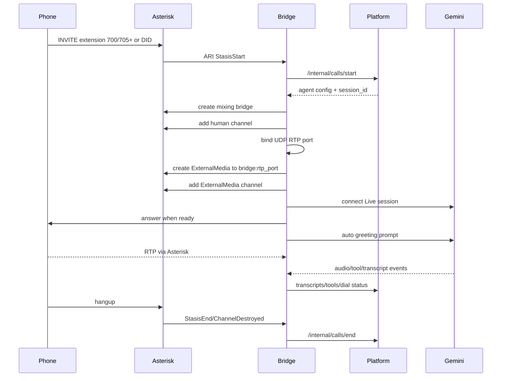
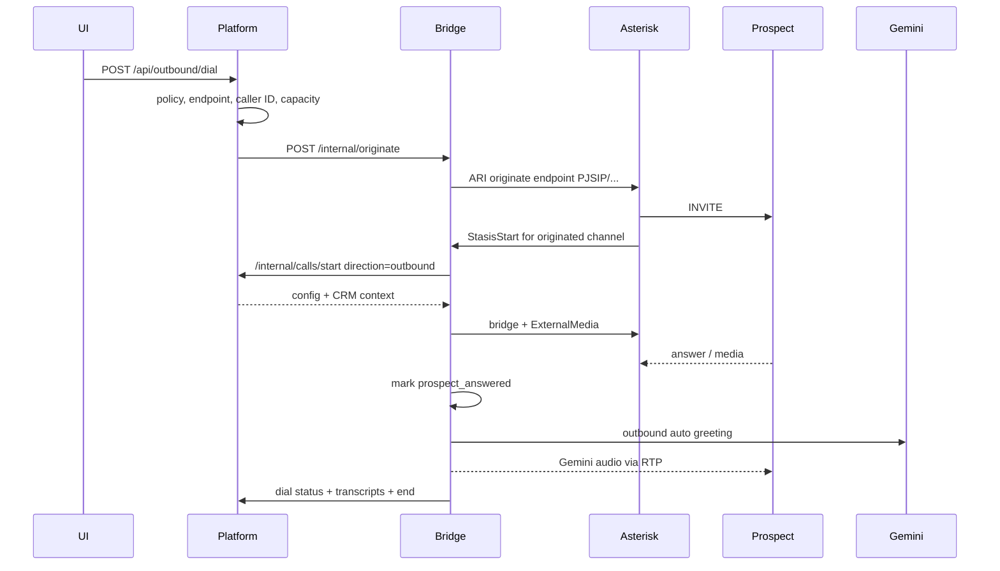

Generated From: Current Repository State
Last Reviewed: 2026-07-01
Source of Truth: Code
Intended Audience: AI Coding Assistants & Developers
Estimated Reading Time: 10-15 minutes

# Overview

Telephony is split across Asterisk and the Python bridge:

- Asterisk handles SIP registration, PJSIP endpoints, dialplan, RTP range, ARI HTTP/WebSocket, and ExternalMedia channels.
- The bridge handles ARI Stasis events, outbound originate, per-call ARI bridges, ExternalMedia RTP sockets, Gemini Live sessions, audio conversion, transcript/tool forwarding, and cleanup.
- The backend platform supplies per-call configuration and persists call results.

The central pattern is:

```
SIP/PSTN call enters Asterisk dialplan
-> Stasis(gemini-agent)
-> bridge receives ARI event
-> bridge asks platform for Gemini config
-> bridge creates Asterisk mixing bridge + ExternalMedia
-> bridge streams RTP <-> Gemini Live
```

The platform intentionally does not process RTP or subscribe to ARI.

# Responsibilities

Asterisk owns:

- SIP endpoint registration for lab phones 1000-1010.
- DIDWW inbound endpoint identification and outbound trunk endpoint template.
- Dialplan contexts `[internal]` and `[from-trunk]`.
- ARI HTTP server on 8088.
- RTP allocation for phone-side media range.
- NAT-sensitive SIP Contact/media address behavior.

Bridge owns:

- ARI client connection and event loop.
- StasisStart/StasisEnd/ChannelDestroyed/Hangup handling.
- ARI originate for outbound calls.
- Per-call `CallSession` and `CallState`.
- Per-call UDP RTP port from `RTP_PORT_BASE..RTP_PORT_BASE+RTP_PORT_COUNT`.
- ExternalMedia creation with `format=ulaw`.
- PCMU/RTP parsing and packet generation.
- Audio resampling between telephony and Gemini rates.
- Optional WebRTC audio processing module.
- Gemini Live websocket lifecycle.
- Forwarding transcripts, tool calls, dial status, and call end to platform.

Backend owns:

- Agent resolution and Live config.
- Call session persistence.
- Tool execution.
- Outbound policy before bridge originate.
- Generated DID dialplan file for organizations.

# Important Files

- `asterisk/extensions.conf`: dialplan source. Calls enter `Stasis(gemini-agent)` from lab extensions and DID contexts.
- `asterisk/pjsip.conf.template`: SIP transport, lab endpoints, NAT settings, DIDWW endpoints/trunk.
- `asterisk/rtp.conf.template`: Asterisk RTP range and NAT externaddr.
- `asterisk/ari.conf`: ARI enabled and user config.
- `asterisk/http.conf`: ARI HTTP bind address/port.
- `asterisk/entrypoint-wrap.sh`: renders runtime PJSIP/RTP config using `EXTERNAL_IP`, SIP passwords, DIDWW settings, and RTP range.
- `asterisk/generated_<env>/org-dids.conf`: generated DID route entries included by `extensions.conf`.
- `bridge/app/main.py`: ARI/RTP/Gemini bridge core.
- `bridge/app/call_session.py`: per-call queues, events, RTP transport, Gemini task references.
- `bridge/app/token_meter.py`: call token usage estimation/extraction.
- `backend/routers/internal_bridge.py`: call lifecycle API consumed by bridge.
- `backend/services/callback_router.py`: inbound sales-agent routing.
- `backend/services/outbound_dialer.py`: policy gate before bridge originate.
- `backend/services/asterisk_registry.py`: generated DID dialplan sync.

# Runtime Flow

## Bridge Startup

Bridge FastAPI lifespan creates a global `GeminiLiveBridge` and calls `bridge.start()`.

Startup behavior:

1. Read required `GEMINI_API_KEY`.
2. Configure Gemini fallback model/voice.
3. Read ARI host/port/user/pass/app.
4. Read platform URL/token.
5. Initialize RTP port pool.
6. Create ARI HTTP client.
7. Wait for Asterisk ARI.
8. Start ARI event loop and stats loop.

There is no global Gemini session. Gemini Live connects only after an actual call enters Stasis.

## Inbound Call Lifecycle



Asterisk does not `Answer()` the AI extension in dialplan. Bridge controls ring/answer timing after Gemini is ready.

## Outbound Call Lifecycle



The bridge tracks phases such as originating, ringing, connecting, in_call, and ended. The platform polls bridge status through backend endpoints and also stores dial status in session metadata.

## ARI Event Lifecycle

Important event handling in `bridge/app/main.py`:

- `StasisStart`: main call setup path. ExternalMedia StasisStart events are ignored as media legs.
- `StasisEnd`: human channel ended, cleanup.
- `ChannelDestroyed`: cleanup when a channel disappears.
- `ChannelHangupRequest`: record hangup cause and cleanup.
- Channel state/dial events: detect ringing/answer for outbound calls.
- Bridge/channel left events: cleanup if human channel leaves bridge.

Cleanup sends final dial status, flushes transcripts, posts call end to platform, cancels Gemini/pacer tasks, tears down RTP transport, deletes ARI resources best-effort, releases RTP port, and removes call state.

# Data Flow

## Media Flow

Inbound audio:

```
Caller phone
-> SIP/RTP to Asterisk
-> Asterisk ExternalMedia sends PCMU RTP to bridge UDP port
-> bridge parses RTP payload type 0
-> ulaw to PCM16 8 kHz
-> resample to PCM16 16 kHz
-> optional WebRTC APM
-> queue Gemini chunks
-> Gemini Live realtime input
```

Outbound audio:

```
Gemini Live 24 kHz PCM16
-> bridge resamples to 8 kHz
-> PCM16 to ulaw
-> RTP packetization payload type 0
-> paced sender emits one 20 ms frame
-> Asterisk ExternalMedia bridge
-> SIP/RTP to phone
```

When APM is enabled, Gemini output is also resampled to 16 kHz and fed as far-end reference for echo cancellation.

## Control Flow

```
Asterisk ARI events
-> bridge event loop
-> platform /internal/calls/start
-> Gemini Live config
-> Gemini Live session
-> bridge forwards transcripts/tools/end
-> platform persistence and post-call processing
```

## Dialplan Flow

```
[internal]
600 -> Answer + Echo
700 -> Stasis(gemini-agent)
701-704 -> Goto(700,1)
705-799 -> Stasis(gemini-agent), platform routes by dialed extension
1000-1010 -> Dial(PJSIP/<ext>) for extension sanity calls

[from-trunk]
_X. / _+X. / explicit DID -> Stasis(gemini-agent)
generated/org-dids.conf included
```

# Dependencies

Telephony dependencies:

- Asterisk image `andrius/asterisk:22`.
- PJSIP, ARI, ExternalMedia, RTP modules enabled through Asterisk config.
- Bridge Python deps: FastAPI, uvicorn, httpx, websockets, google-genai, numpy, samplerate/libsamplerate, pywebrtc-audio, audioop-lts if needed.
- Google Gemini Live API.
- Platform internal HTTP.

Networking:

- Asterisk is on `voip` network.
- Bridge is on `voip` network.
- Platform is on both `default` and `voip`.
- Frontend is on default network and proxies to platform.
- SIP UDP host port is exposed in host mode by environment overlay.
- ARI port is exposed to host for diagnostics.
- Asterisk RTP range is exposed to host.
- Bridge RTP ports are internal Docker network ports used by Asterisk ExternalMedia unless explicitly exposed.

# Configuration

Important Asterisk variables:

- `EXTERNAL_IP`: LAN/public address placed into PJSIP `external_media_address`, `external_signaling_address`, RTP `externaddr`, and endpoint `media_address`.
- `SIP_PORT`: host-published SIP port; staging uses 5061.
- `ASTERISK_RTP_START`, `ASTERISK_RTP_END`: Asterisk phone-side RTP range.
- `SIP_PASS_1001` ... `SIP_PASS_1010`: lab prospect endpoint passwords.
- `DIDWW_SIP_USER`, `DIDWW_SIP_SECRET`, `DIDWW_FROM_DOMAIN`: DIDWW outbound trunk auth/domain.

Important bridge variables:

- `GEMINI_API_KEY`: required.
- `GEMINI_MODEL`, `GEMINI_VOICE`: fallback values if platform config lacks them.
- `ARI_HOST`, `ARI_PORT`, `ARI_USER`, `ARI_PASS`, `ARI_APP`: ARI connection settings.
- `PLATFORM_URL`: bridge-to-platform URL.
- `BRIDGE_INTERNAL_TOKEN`: shared internal API secret.
- `MAX_CONCURRENT_CALLS`: bridge active call cap.
- `RTP_PORT_BASE`, `RTP_PORT_COUNT`: bridge per-call ExternalMedia ports.
- `EXTERNAL_MEDIA_HOST`: hostname/IP Asterisk uses for bridge RTP target; defaults to `bridge`.
- `GEMINI_CHUNK_MS`, `INBOUND_GAIN`, `APM_ENABLED`, `TTS_GATING`, timeout/gating variables: media behavior tuning.

# Design Decisions

- Stasis/ARI is used instead of a static dialplan answer because Gemini readiness and ExternalMedia setup are asynchronous.
- ExternalMedia keeps Asterisk as the SIP/RTP anchor while letting Python own AI media conversion.
- PCMU/G.711 is the preferred codec because templates allow ulaw/alaw and bridge handles payload type 0 PCMU.
- The bridge paces outbound RTP at 20 ms because Asterisk jitter buffers expect ptime-paced RTP, not bursty model chunks.
- libsamplerate is used instead of `audioop.ratecv` because the code comments identify quality/VAD problems with `ratecv`.
- Optional WebRTC APM exists because browser mic audio gets echo cancellation/noise suppression/gain control automatically; raw telephony audio does not.
- One call equals one RTP port, one Gemini session, one state object, and separate queues. This is the concurrency boundary.
- Bridge cleanup is defensive because outbound ARI channels may not always emit the same end events as inbound calls.
- NAT configuration is generated at container start because phones need the host LAN address, not the Docker container address.

# Critical Files

- `bridge/app/main.py`: do not make casual changes. It combines event handling, media timing, Gemini API behavior, and cleanup.
- `asterisk/pjsip.conf.template`: NAT and Contact behavior are critical. Comments document known failures.
- `asterisk/extensions.conf`: controls whether calls enter bridge at all.
- `asterisk/entrypoint-wrap.sh`: token rendering for PJSIP/RTP templates.
- `asterisk/rtp.conf.template`: RTP range and externaddr.
- `backend/routers/internal_bridge.py`: bridge/platform contract.
- `backend/services/callback_router.py`: inbound DID/fleet/callback routing.
- `backend/services/asterisk_registry.py`: generated DID dialplan.

Generated files:

- `asterisk/generated_<env>/org-dids.conf`: source is backend organization rows.
- Runtime `/etc/asterisk/pjsip.conf`.
- Runtime `/etc/asterisk/rtp.conf`.

# Common Debugging

- Phone cannot register: verify phone uses `.host.<env>.env` `EXTERNAL_IP:SIP_PORT`, not `127.0.0.1` or Docker IP; check `pjsip show endpoints`.
- Call drops around 30 seconds: inspect PJSIP Contact/NAT. Avoid broad `local_net`; template comments warn against Docker SNAT/localnet mistakes.
- No audio: dial 600 echo first, confirm PCMU codec, check RTP range, check `external_media_address`, inspect bridge first RTP logs.
- Bridge not connected to ARI: check `ari.conf`, `http.conf`, ARI user/pass/app env, and `/ari/applications`.
- Calls enter Asterisk but not platform: check bridge logs for StasisStart and platform `/internal/calls/start` errors.
- Gemini silent: check `GEMINI_API_KEY`, platform returned model/voice/config, bridge Gemini loop logs, and auto greeting.
- Outbound no answer/stuck ringing: inspect bridge dial status, endpoint registration, ARI originate response, and `OUTBOUND_ANSWER_TIMEOUT_SEC`.
- Multiple calls fail: check `MAX_CONCURRENT_CALLS`, bridge free RTP ports, and Asterisk RTP/ExternalMedia resource cleanup.
- Generated DID not routing: inspect `asterisk/generated_<env>/org-dids.conf`, `#include generated/org-dids.conf`, and dialplan reload.

# AI Guidance

Architectural invariants:

- Asterisk should route AI calls into `Stasis(gemini-agent)`.
- Bridge is the only ARI subscriber for `gemini-agent`.
- Platform remains data/config/tool execution service, not media service.
- Do not send all Gemini tools to every agent; backend filters by `enabled_tools`.
- Preserve per-call isolation of queues, RTP state, APM state, Gemini session, and cleanup.
- Keep RTP pacing at 20 ms unless you deeply test audio behavior.
- Keep bridge/platform calls authenticated with `X-Bridge-Token`.

Where to change:

- New lab extension behavior: `asterisk/extensions.conf` plus backend routing if agent-specific.
- New SIP endpoint: `asterisk/pjsip.conf.template`, `entrypoint-wrap.sh` password/env handling, and check script if expected.
- New DID routing: backend organizations and `asterisk_registry.py`, not manual generated file edits.
- New outbound trunk/provider: PJSIP template and endpoint resolver/outbound settings.
- New media processing: bridge `handle_rtp_packet`, `_enqueue_output_audio`, and related constants.
- New bridge status fields: bridge `/internal/status`, backend `outbound.py` status enrichment, frontend consumers.

Avoid:

- Confusing Asterisk RTP range with bridge RTP port pool.
- Answering AI calls directly in dialplan before Gemini is ready.
- Hard-coding an IP into Asterisk templates.
- Treating 701-704 as fixed agent extensions; they currently alias to fleet 700.
- Removing the generated DID include without replacing organization DID routing.
- Adding frontend calls to ARI/bridge endpoints.
